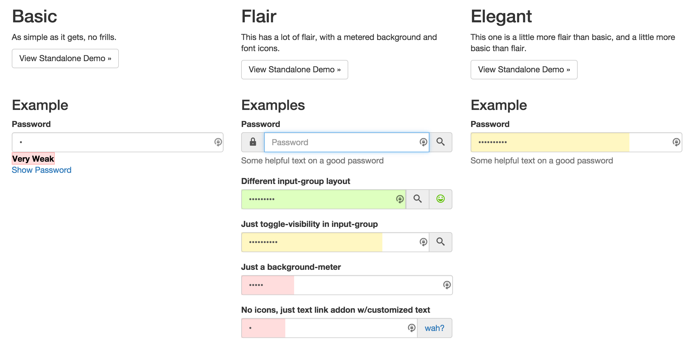

bootstrap-password
===========
Bootstrap based password field with declarative options and extensive customizability.

[Multiple demos available showing customization options.](http://alienfast.github.io/bootstrap-password/)

Customize via:
* Javascript options (html, i18n, calculation regexes or calculation fn)
* CSS overrides
* SCSS variables
* Coffescript subclassing

Available as a bower package.

# Screenshot


# Usage

## Distribution files
All distributions are in the `public` directory.  Necessary files are:
* `js/bootstrap-password.js`
* `css/bootstrap-password.css` (or the `scss` files in `app/lib`)

## Code
* Structure a standard bootstrap password field with a surrounding `form-group`
```html
    <div class="form-group">
        <label for="flair-pw1">Password</label>
        <input type="password" class="form-control" id="flair-pw1" placeholder="Password">
        <span class="help-block">Some helpful text on a good password</span>
    </div>
```
* Initialize the field with options, minimally:
```javascript
    <script>
        require('bootstrap-password');
        $(document).ready(function($) {
            $('#flair-pw1').bootstrapPassword();
        });
    </script>
```


# Development

## Stack
This project is authored in coffescript and scss.

### Brunch
[Brunch](http://brunch.io) is a html5 application builder that's agnostic to programming langs and frameworks.

`brunch-config.coffee` contains brunch configuration, `package.json` contains brunch plugins.

### Bootstrap
The project imports bootstrap variables and utilizes them throughout.  Additionally, like bootstrap, it declares variables that can be overridden
if you choose to `@import` the optional `scss` files as opposed to using the static `css`

### Bower
It is accessible via the bower package manager.

## Getting started with development
* Clone the project.
* Install bower via nodejs: `npm install -g bower`
* Install bower plugins: `bower install`
* Install brunch via nodejs: `npm install -g brunch`
* Install brunch plugins: `npm install`
* Run pre build: `cake build:pre`
* Run dev server: `clear; DEBUG='brunch:*,-brunch:source-file,-brunch:watch' brunch watch --server`
* Open `127.0.0.1:3333`
* Check out some demos

### Tests
* Run tests via RubyMine by running the `karma.conf.js` file; or
* `cake build:test`


## Contributing
1. Fork it
2. Create your feature branch (`git checkout -b my-new-feature`)
3. Commit your changes (`git commit -am 'Add some feature'`)
4. Push to the branch (`git push origin my-new-feature`)
5. Create new Pull Request


## Copyright
Copyright (c) 2014 AlienFast, LLC and others. See LICENSE.txt for further details.